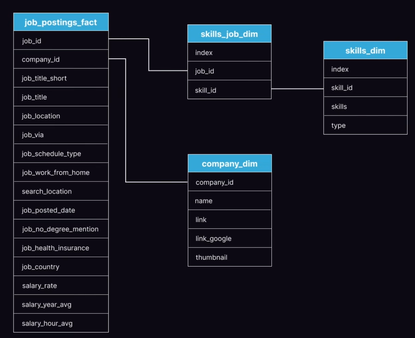

# Introduction

This project is the first of multiple projects meant to showcase my knowledge of GitHub and various data science tools, in this case SQL. For this project, I worked with a dataset documenting over 1,000,000 data job postings online (data scientist, data engineer, etc.). Since this project focuses on my knowledge of SQL, I will explain all my queries and outputs without focusing on visualizations, as my other projects will cover the visualization process more extensively.

From this dataset, I wanted to know a few things:
- Which skills are in the most demand for data science jobs?
- Which companies are offering the most jobs that fit my skill set?
- Which skills and companies offer the highest pay?

# Dataset



*Dataset and visual above sourced from Luke Barousse on YouTube 

https://www.youtube.com/watch?v=7mz73uXD9DA*

The database as visualized above contains 4 tables. The largest table, job_postings_fact contains the key details about each documented job posting. It contains details such as the location of the job, whether it was work from home, the average salary, the company offering the job, and any skills needed for the job. 

The company_dim table documents the companies offering each job, providing details like the company name and a link to them on Google.

The skills_job_dim table is an intersection table meant to document which skills each job requires. An intersection table was necessary because jobs can have multiple skills and skills can have multiple jobs. 

The skills_dim table documents the skills, providing details like the name of the skill and what type it is, such as “programming” or “analyst_tools”.

  

To see the SQL statements used to create the database, see [database_creation](database_creation)  

*Since the same source as the dataset provided the statements, this project will not cover them. I understand the statements used and have the skills to create a database in SQL.*

# Tools Used

**SQL:** Allows me to query the dataset.  
**PostgreSQL:** The chosen database management system.  
**Visual Studio Code:** Used to write my SQL queries, connected to my PostgreSQL database using the SQLTools extension.  
**Git & GitHub:** Used to document and share my SQL queries and analysis.

# Analysis

All the discussed queries are stored in [project_queries](project_queries)  

### Simple Exploration

For my first queries, I wanted to do some simple exploration of the dataset, so I started by determining what time period my dataset was based in and whether any months had more job postings than others. To accomplish this, I extracted the year and month from the dataset and grouped by both.   

For each showcase query, I will provide the SQL statement and the results, which may be truncated if the resulting table from the query is too large.

```sql
SELECT
    EXTRACT(MONTH FROM job_posted_date) AS month_posted,
    EXTRACT(YEAR FROM job_posted_date) AS year_posted,
    COUNT(job_posted_date)
FROM job_postings_fact
GROUP BY year_posted, month_posted
ORDER BY year_posted, month_posted;
```
| month_posted | year_posted | count  |
|--------------|-------------|--------|
| 12           | 2022        | 1895   |
| 1            | 2023        | 92266  |
| 2            | 2023        | 64560  |
| 3            | 2023        | 64158  |
| 4            | 2023        | 62915  |
| 5            | 2023        | 52235  |
| 6            | 2023        | 61500  |
| 7            | 2023        | 63855  |
| 8            | 2023        | 75067  |
| 9            | 2023        | 62433  |
| 10           | 2023        | 66601  |
| 11           | 2023        | 64404  |
| 12           | 2023        | 55797  |

From the results, we can see that most of the dataset is from 2023, with a small portion from December 2022. We can also notice that there is a spike in postings around the New Year with 92266 postings and that the rest of the year remains mostly stable around 60000, with August as the only other notable exception with 75000 postings.

I also wanted to check how many jobs are being offered from home versus locally, so I did another quick query grouping by the job_work_from_home (True/False) column.

```sql
SELECT
    CASE
        WHEN job_work_from_home THEN ‘Work From Home’
        ELSE ‘In Person’
    END,
    COUNT(*)
FROM job_postings_fact
GROUP BY job_work_from_home;
```
| case            | count   |
|-----------------|---------|
| In Person       | 718080  |
| Work From Home  | 69606   |

The vast majority of job listings were in-person job postings, with there being over 10 times more in-person job postings than work-from-home job postings.

### Available Jobs

For the next step of my analysis, I wanted to determine how many of the postings were available to me. To achieve this, I used WHERE to filter the dataset to only jobs in Maryland or work-from-home based in the United States. I also pulled the columns for the yearly salary, job title, and joined with the company table to get the company name.

```SQL
SELECT 
    job_location AS location,
    job_title_short AS job_title,
    salary_year_avg AS yearly_salary,
    company.name AS company_name
FROM job_postings_fact AS job_postings
LEFT JOIN company_dim AS company
    ON job_postings.company_id = company.company_id
WHERE 
    (job_location LIKE '%MD' OR 
    job_work_from_home = TRUE) AND
    job_country = 'United States'
ORDER BY salary_year_avg DESC;
```
| location                 | job_title           | yearly_salary | company_name                 |
|--------------------------|---------------------|----------------|------------------------------|
| Anywhere                 | Data Analyst        |                | Axelon Services Corporation  |
| Anywhere                 | Data Engineer       |                | Signify Technology           |
| Anywhere                 | Data Engineer       |                | Enlighten                    |
| Greenbelt, MD           | Data Scientist      |                | ADNET Systems, Inc.          |
| Anywhere                 | Data Engineer       |                | Signature Consultants        |
| Anywhere                 | Data Engineer       |                | OneSeven Tech                |
| Bethesda, MD            | Data Scientist      |                | Leidos                       |
| Linthicum Heights, MD   | Senior Data Analyst |                | BAE Systems                  |
| Fort Meade, MD          | Data Engineer       |                | ClearanceJobs                |
| Anywhere                 | Data Scientist      |                | KE Staffing                  |

*the first 10 of 28744 rows*

One notable result from this query is that the salary value is null for a large portion of the dataset (including the 10 shown above). I did an additional query to filter out null values for yearly salary, and only 3000 of the 28744 rows had a non-null value. 

Another notable result is that work-from-home jobs outnumber Maryland jobs. I modified the second query in the simple exploration step and determined that only 5766 of the 28744 jobs available were in Maryland.

### Jobs by Title

The dataset contains job postings for a variety of jobs in the data field and next I wanted to determine which types of jobs were documented and which had the highest salary. I also wanted to account for the findings of the previous query. To accomplish this, I ignored any work-from-home jobs to focus on Maryland jobs. Next, I grouped by the job title and counted how many postings each job has, averaged the yearly salaries, and counted how many data points (non-null values) there were for the salaries. By counting the number of data points I can determine which salaries have enough datapoints for their average salary to be representative of the true average.

```SQL
SELECT 
    job_title_short AS job_title,
    COUNT(job_id) AS job_count,
    ROUND(AVG(salary_year_avg)) AS salary_average,
    COUNT(salary_year_avg) AS salary_datapoints
FROM job_postings_fact
WHERE 
    job_location LIKE '%MD'
GROUP BY job_title_short
ORDER BY job_count DESC;
```
| job_title                  | job_count | salary_average | salary_datapoints |
|---------------------------|-----------|----------------|--------------------|
| Data Scientist            | 2348      | 124803         | 163                |
| Data Analyst              | 1706      | 96903          | 121                |
| Data Engineer             | 818       | 143892         | 71                 |
| Senior Data Scientist     | 354       | 148256         | 22                 |
| Senior Data Engineer      | 227       | 169093         | 16                 |
| Senior Data Analyst       | 201       | 98508          | 15                 |
| Business Analyst          | 76        | 93151          | 7                  |
| Software Engineer         | 31        | 173667         | 3                  |
| Machine Learning Engineer | 8         | 152500         | 1                  |
| Cloud Engineer            | 7         |                | 0                  |

From the results we can see that data scientists and data analysts have the most job postings in Maryland. We can also notice how for some titles the sample size is small enough that there are very few data points for the average salary. For example, cloud engineer has 7 postings, but 0 of which contain a salary. Other job titles like Data Engineer have many more data points, so their average salary will  be less affected by outliers and more representative of the true average salary. I am at college majoring in data science, so it is nice to see that it both has the most job postings and a good salary.

### Skills in Demand

Now that I have a good idea of how many job postings are made in my field, I want to determine which skills I should be focusing the most on as a data scientist. To accomplish this, I first started by using a CTE to query the intersection table. I grouped by the skill ID and counted how many jobs require each skill, the average salary of those jobs, and the number of data points for that salary. Next, to turn the CTE into a more readable table that uses the skill names instead of IDs and includes the skill type, I queried the CTE and joined it with the skill_dim table to get the skill name and type.

```SQL
WITH jobs_per_skill AS(
    SELECT
        skills_job.skill_id,
        COUNT(*) AS skill_count,
        ROUND(AVG(salary_year_avg)) AS average_salary,
        COUNT(salary_year_avg) AS data_points
    FROM skills_job_dim AS skills_job
    INNER JOIN job_postings_fact AS job_postings
        ON skills_job.job_id = job_postings.job_id
    WHERE 
        job_location LIKE '%MD' AND
        job_title_short = 'Data Scientist'
    GROUP BY skills_job.skill_id
)

SELECT
    skill_count,
    skills AS skill_name,
    skills_dim.type AS skill_type,
    average_salary,
    data_points AS salary_datapoints
FROM jobs_per_skill
INNER JOIN skills_dim
    ON jobs_per_skill.skill_id = skills_dim.skill_id
ORDER BY
    skill_count DESC;
```
| skill_count | skill_name | skill_type     | average_salary | salary_datapoints |
|-------------|------------|----------------|----------------|--------------------|
| 1675        | python     | programming    | 125716         | 119                |
| 1051        | r          | programming    | 119944         | 74                 |
| 858         | sql        | programming    | 129824         | 61                 |
| 537         | tableau    | analyst_tools  | 118895         | 28                 |
| 354         | aws        | cloud          | 126612         | 23                 |
| 322         | java       | programming    | 135940         | 21                 |
| 319         | sas        | analyst_tools  | 123576         | 25                 |
| 319         | sas        | programming    | 123576         | 25                 |
| 268         | hadoop     | libraries      | 120413         | 25                 |
| 267         | excel      | analyst_tools  | 119533         | 21                 |

*The first 10 of 169 rows*

From the results we can see that Python is the most in-demand skill, with 1675 job postings requiring it. SQL is in third with 858 postings. Of the top 10 skills, Java has the highest average salary at $135940.

### Companies with Jobs

Lastly, I wanted to determine which companies were offering jobs with skills within my skill set. Accomplishing this was a bit trickier than the others. I first needed to determine which jobs in the job_postings_fact table had at least one skill requirement within my skill set. For this, I used a subquery on the intersection table to get the distinct job IDs that have one of the skills in the list. Next, I used that subquery in the WHERE clause of a CTE to create a temporary dataset grouped by company ID with the average salary and number of jobs. I then query that CTE so I can include the company name and link on Google.

```SQL
WITH company_jobs AS (
    SELECT
        company_id,
        ROUND(AVG(salary_year_avg)) AS average_salary,
        COUNT(job_postings.company_id) AS job_count
    FROM job_postings_fact AS job_postings
    WHERE 
        job_location LIKE '%MD' AND
        job_title_short = 'Data Scientist' AND
        job_id IN (
            SELECT
                DISTINCT job_id
            FROM skills_job_dim AS skills_job
            INNER JOIN skills_dim
                ON skills_job.skill_id = skills_dim.skill_id
            WHERE
                skills IN ('python', 'r', 'sql', 'sas', 'excel',
                'power bi', 'matlab')
        )
    GROUP BY company_id
    ORDER BY job_count DESC
)

SELECT 
    company_dim.name AS company_name,
    average_salary,
    job_count,
    link_google
FROM company_jobs
INNER JOIN company_dim
    ON company_jobs.company_id = company_dim.company_id;
```
| company_name                                                     | average_salary | salary_datapoints | job_count |
|------------------------------------------------------------------|----------------|--------------------|-----------|
| Guidehouse                                                       | 107500         | 3                  | 190       |
| Booz Allen Hamilton                                              | 128046         | 13                 | 148       |
| Leidos                                                           | 115571         | 18                 | 104       |
| Peraton                                                          | 142667         | 6                  | 44        |
| The Johns Hopkins University Applied Physics Laboratory          |                | 0                  | 38        |
| ClearanceJobs                                                    |                | 0                  | 30        |
| LEIDOS                                                           |                | 0                  | 25        |
| BlueHalo                                                         | 108416         | 1                  | 19        |
| Blend360                                                         | 91600          | 5                  | 18        |
| CACI                                                             |                | 0                  | 18        |


*The first 10 of 577 rows*  
*The Google link column has been exluded due to it's length*

From the results we can see that Guidehouse and Booz Allen Hamilton have made the most job postings, with a combined 338 postings for data scientists. However, Booz Allen Hamilton seems to be offering higher salaries with more datapoints to back it. Peraton offer the highest average salary among the top companies but has only a third of the offerings of Booz Allen Hamilton.

# Conclusion and Takeaway

Through this project I learned a lot about the data science job market and how I should prepare myself as a college student.  

First, I should take time to build up knowledge in high-demand skills I'm less familiar with, such as Python and Power BI/Tableau. This project is the first of many I plan on doing. Eventually I plan on having a project for Excel, Power BI, and Python.

Second, there are lots of jobs in my field, and companies like Guidehouse and others have collectively made hundreds of postings in my skill set. This doesn't even account for jobs and internships that were not posted online or the thousands of work-from-home jobs.

Third, jobs requiring skills in Java offer the highest pay among the top skills, but other similar skills like Python are much more common with a still comparable salary. Similarly, the company Peraton offers the highest-paying jobs among the top companies, but Booz Allen Hamilton has made more job postings with comparable salaries.

Thank you for reading my SQL project. I hope you found some useful takeaways for yourself too. 


